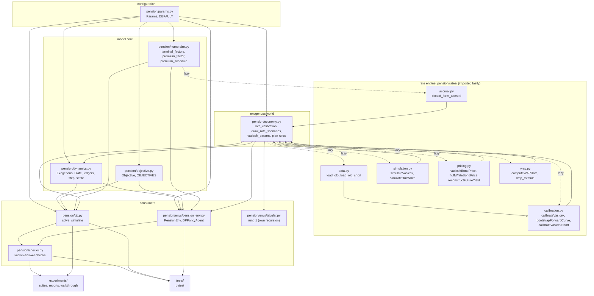

# Architecture

## Purpose

The code computes and evaluates how a Belgian employer should fund a second-pillar (WAP/LPC, Branch 21) plan for one member. The trade-off is between the employee's replacement rate and the employer's cost:
- the premiums;
- the statutory return guarantee, which the employer must top up at retirement.

All of it is measured in retirement-date money under the real-world measure. Interest rates, the WAP guarantee rate G_t and the insurer's book yield μ_t follow a stochastic model of the 10-year OLO. Staff turnover is a hazard.

Three rungs, each validating the next:

| rung | code | what it is | what it validates |
|---|---|---|---|
| 1 | `pension/envs/tabular.py` | tabular Monte Carlo control on a binary contribute/skip decision, deterministic or one shock | that an agent recovers a known optimum (sweep / local-search benchmarks) |
| 2 | `pension/dp.py` | dynamic programming on the reduced state (t, F, ρ), with Gauss-Hermite quadrature and churn | the oracle: the exact optimum at constant rates; a certainty-equivalent policy under stochastic rates |
| 3 | `pension/envs/pension_env.py` | a gymnasium environment on the same dynamics and objective | that a learned policy is scored on exactly the DP's scale (the episode-return contract); RL can use the information the DP cannot carry (rate history, ledger mix) |

The canonical configuration:
- `EMPLOYER_NUMERAIRE = "retirement"`; the name misdescribes it, it is a valuation date (`docs/REVIEW.md` m9);
- `RATE_MODEL = "vasicek"`, with the constant-rate model as the DP-verifiable rung;
- `hull_white_p` is for robustness only;
- `vasicek_short`, `hull_white` (Q) and "discounted" are legacy/regression only.

---

## Layers

**Dependency direction:** arrows point from provider to user. The model core never imports `experiments/` or `tests/`.

**Lazy imports (dashed arrows):**
- `economy.rate_calibration` and `economy._draw_rate_scenarios` import `pension.rates.*` inside the functions, so the constant-rate model never loads the rate engine, pandas or the NBB data.
- `numeraire.premium_factor` imports `rates.accrual` only for a stochastic model under "retirement".
- `rates.accrual` imports `economy` back, also lazily, for the model parameters.

The tabular rung reads module-level constants from `economy` at import (`economy.py:25-26`), not a `Params`. It is the one place left with module state (REVIEW m4).

---

## Data flow: one scenario, from the NBB CSV to `simulate()["joint"]`

<!-- gen:calibration -->
Data vintage: 321 monthly 10Y observations up to Sep 2026 (t0). Canonical vasicek: kappa 0.1104, theta 2.23%, sigma 0.61%, y0 4.12%, spread 128.4 bp.
<!-- /gen -->

1. **Data.** `rates.data.load_olo()` reads `pension/rates/data/olo_yields.csv`, fetching it from the NBB once if it is missing. It returns the monthly 10Y history (`df10Y`) and the latest cross-section. `load_olo_short()` returns the shortest maturity (1Y).
2. **Calibration, once per process.** `economy.rate_calibration()` runs:
   - `calibrateVasicek(df10Y)`: OLS of Δy on y, giving κ, θ, σ and y_0;
   - `calibrateVasicekShort(df_1Y, df10Y)`: gives the historical mean (10Y − 1Y) spread among other things;
   - `bootstrapForwardCurve(...)`: the NSS curve, used by the Hull-White models only.

   The result is cached in `_CALIBRATION`, keyed on the data vintage (`economy.data_vintage()`).
3. **Model parameters.** `economy.vasicek_params(p)` gives κ, σ, θ (`p.LONG_RATE_P` + spread if set, else OLS), y_0 = the last observed 10Y, and the spread (`p.SPREAD_10Y_SHORT`, else the historical mean).
4. **Rate paths.** `economy.draw_rate_scenarios(n, p=p)` calls `_draw_rate_scenarios`, which calls `rates.simulation.simulateVasicek(κ, θ, σ, y_0)`. That produces monthly 10Y paths y_m (exact discretisation, `np.random.default_rng(RATE_SEED)`, blocks of 10,000 paths). The short rate is r_m = y_m − spread.
5. **Contract rates.** The observed 10Y history is prepended to the simulated months (row 0 of the simulation is the last observation). Model years are calendar years (`YEAR_START = "january"`): year 0 starts `economy.premonths(p)` months later, on the next 1 January, and the simulation runs one extra year to cover that pre-roll. Then:
   - `rates.wap.computeWAPRate(full, start, T)` gives G[k], the WAP rate of model year k: 0.85 × the mean of the 24 months to May of the year before (`WAP_LAG` = 8 months before 1 January), rounded to 25 bp, clipped to [1.75%, 3.75%].
   - A rolling mean over `BOOK_DURATION` years gives μ[k], the book yield.
   - From r_m: r[t] = r_m at year t's 1 January, and acc[t] = exp(Σ of year t's 12 monthly r·dt), the realised accrual.

   The result is cached in `_SCENARIOS` (bounded) by a key of `Params` inputs and the data vintage; its arrays are read-only. `simulate` and `solve` refuse a scenario of another model (`economy.check_scenario`).
6. **Careers.** `dynamics.Exogenous.draw(p, n, seed, rates)` draws the career noise from `default_rng(seed)`, per year z_R, z_L, u, and attaches G, μ, r, acc. `dynamics.State.initial(...)` opens a `HorizontalLedger`.
7. **Years.** `dp.simulate` loops t = 0..T−1:
   - `bilinear` reads the policy at (F, log ρ);
   - the premium cost is `objective.contribution(a, t) × numeraire.premium_factor(t, r_t)`, where the premium factor is A(t,T; r_t) from `rates.accrual.closed_form_accrual`;
   - `dynamics.step` advances the state.
8. **Retirement.** `dynamics.settle` gives the payout max(R, L), the shortfall (L − R)⁺ and the service fraction. `objective.employee` and `objective.shortfall` are applied, times `numeraire.terminal_factors` (= 1 at retirement).
9. **Joint value.** `joint = w_emp·mean(benefit) − w_er·mean(cost)`. `PensionEnv` pays the same pieces as per-step rewards, so the mean episode return equals `joint` (contract C1 below).

A full worked instance with every intermediate number: `paper/explanations/model-walkthrough.md`.

---

## Contracts

| # | contract | why it matters | pinned by |
|---|---|---|---|
| C1 | mean `PensionEnv` episode return = `simulate(...)["joint"]` on the same paths | RL and the DP oracle are scored on one scale | `tests/test_env.py::test_episode_returns_equal_simulate_joint` (both valuation dates; constant, banded, vasicek), `tests/test_numeraire.py::test_env_contract_both_numeraires` |
| C2 | `dp.F_next` / `rho_next` = `dynamics.step` (vertical ledger, constant rates) | the DP's reduced transitions are the simulated dynamics | `tests/test_dynamics.py::test_one_year_in_force_matches_F_next_rho_next`, `tests/test_numeraire.py::test_reduced_form_matches_step` |
| C3 | paid-up roll-forward = `dp.paidup_service`'s closed form | leavers are valued exactly | `tests/test_dynamics.py::test_paid_up_roll_forward_matches_paidup_service` |
| C4 | the "discounted" valuation reproduces the pre-refactor model bit for bit | the old results stay reproducible | `tests/test_regression.py` (golden files from `8fbf451`) |
| C5 | retirement-date valuation at λ′ = inception-date valuation at λ (constant rates) | the change of valuation date is a positive rescaling | `tests/test_numeraire.py::test_retirement_equals_discounted_at_lambda_prime` |
| C6 | the horizontal ledger = its closed form, and = 9 rate buckets | the vintage bookkeeping is right | `tests/test_dynamics.py` |
| C7 | the closed-form accrual = Monte Carlo of the realised accrual | the premium factor is the conditional expectation | `tests/test_numeraire.py::test_accrual_accuracy_vasicek`, `tests/test_rates.py` (no floor beyond 4 standard errors + 0.1 bp) |

**What the DP optimises in rate mode** (`dp.solve`): the certainty-equivalent model. It is a constant-rate DP on (t, F, ρ) with:
- G, μ = the scenario means;
- σ_L = 0, σ_R = `SIGMA_R_RATES` (`CE_MOMENTS = "conditional"`: G_t and μ_t are known at the start of each year; `"levels"` is the legacy level-dispersion match);
- a vertical ledger;
- one premium factor per year, equal to the scenario mean of A(t,T; r_t).

The solved policy cannot react to r_t, G_t or the vintage mix; `simulate` scores it on the true paths.

---

## Randomness

| stream | seed | used for | common random numbers |
|---|---|---|---|
| rate scenarios | `p.RATE_SEED` (2026) via `default_rng`, in `_draw_rate_scenarios` | 10Y / short-rate paths → G, μ, r, acc | yes: memoised by key, so every `simulate` with the same n and `Params` sees the same scenarios. The CE solve uses `RATE_CE_PATHS` (5000) scenarios with the same seed |
| career noise | the `seed` argument of `simulate` (default 7) → `Exogenous.draw` | z_R, z_L, churn u, drawn per year in that order | yes: two policies simulated with the same seed see identical shocks and churn |
| entry cohort | `dp.new_plan_init(n, rng)` with the caller's rng (suites: `common.entry(n, seed)`) | F_0, ρ_0 | yes, when the caller reuses the seed |
| RL environment | `reset(seed=…)` seeds `env.np_random` | per episode: a fresh `Exogenous` seed (`integers(2**63-1)`), a rate path drawn from a pool of `rate_pool` scenarios (drawn once with `RATE_SEED`), the entry state | per episode only; `reset(options={"exogenous", "entry"})` replays given paths |
| tabular rung | `draw_shock_batch(seed=12345)`, `mc_control(seed=0)` | its own frozen batch | within rung 1 |
| legacy | `simulateVasicek` / `simulateHullWhite` without `rng` call `np.random.seed(seed)` (global) | only `experiments/olo/plots.py` | — |

The rate and career streams are independent: different generators and different seeds.

---

## Rate models

| `RATE_MODEL` | measure of the paths | r_t | G_t | μ_t | A(t,T) | allowed valuation dates | status |
|---|---|---|---|---|---|---|---|
| `constant` | — (deterministic G, μ) | `SHORT_RATE` | `G` | `MU` | e^{(r+s)(T−t)} | retirement, discounted | DP-verifiable rung |
| `vasicek` | P (OLS on the monthly 10Y history; θ = `LONG_RATE_P` + spread if set) | y10_t − `SPREAD_10Y_SHORT` | WAP filter of the simulated 10Y (history prepended) | book yield: rolling mean of the 10Y | closed form, Vasicek integral of y minus the spread | retirement, discounted | **canonical** |
| `hull_white_p` | P via a constant φ from `LONG_RATE_P` (`None` ⇒ φ = 0, Q drift) | instantaneous Hull-White short rate | WAP of the Q-repriced 10Y | book yield | closed form, Hull-White with α(t) and m | retirement, discounted | robustness |
| `vasicek_short` | P (OLS on the 1Y) | the 1Y proxy | WAP of the affine 10Y (θ_Q, φ) plus a decaying offset | book yield | closed form, Vasicek | retirement, discounted | legacy |
| `hull_white` | **Q** | Q short rate | WAP of the repriced 10Y | book yield | none (raises) | discounted only | legacy / regression |

Details and caveats: `docs/MODEL.md`, `docs/REVIEW.md` (C1, M1, M5, M7).
