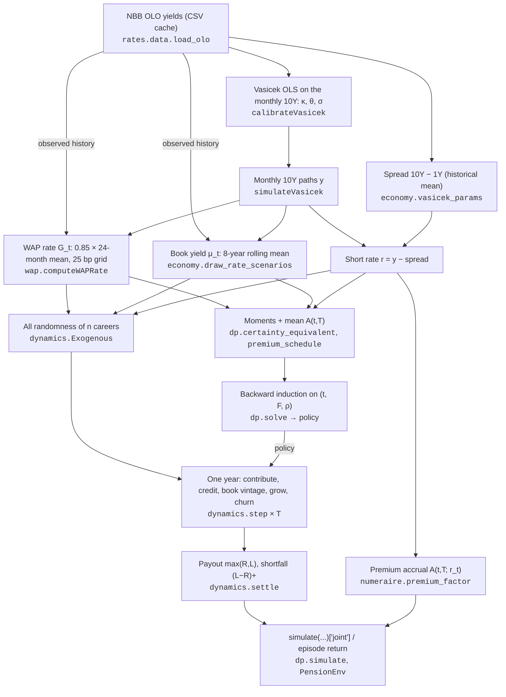

# Model walkthrough: from the OLO data to the objective, and one career by hand

This note follows the model in its **canonical configuration**: `RATE_MODEL = "vasicek"`, with the 10Y OLO modelled directly and calibrated on its history, and both legs of the objective valued at the **retirement date** under the real-world measure.

It follows the model in two ways:
- one interest-rate scenario, end to end, from the NBB data to the joint value $J$ that the DP oracle and the RL agent are scored on (Sections 1–2);
- one plan member, by hand, for three years under constant rates and under vasicek, with the same shocks (Section 3).

It then uses those numbers to show:
- why the reduced state $(t, F, \rho)$ is sufficient at constant rates (Section 4);
- why it stops being sufficient once the guarantee is booked horizontally at moving rates (Section 5).

The numbers come from the code. The blocks between `gen` markers are written by `python experiments/walkthrough.py --write walkthrough`, and `--check walkthrough` fails if any of them no longer matches the code. The script also asserts:
- the step-by-step rebuild of the scenario equals `economy.draw_rate_scenarios`;
- the hand-computed year equals `dynamics.step`;
- the hand-computed accrual equals `rates.accrual.closed_form_accrual` and `numeraire.premium_factor`;
- the RL environment's mean return equals `simulate()["joint"]`.

The model in full: `docs/MODEL.md`; known issues: `docs/REVIEW.md`.

---

## Notation

| Symbol | Meaning | Code |
|---|---|---|
| $R_t$, $L_t$, $S_t$ | Reserve, guaranteed (WAP) reserve, salary | `State.R`, `State.L`, `State.S` |
| $F = R/L$, $\rho = S/L$ | Funding ratio, salary-to-liability ratio | `State.F`, `State.rho` |
| $a_t \in [0,1]$ | Funding decision; contribution $c_t = a_t \Gamma S_t$ | `step(state, a, ...)` |
| $y_t$, $r_t$ | 10Y OLO (modelled), short rate $r_t = y_t - \text{spread}$ | `Exogenous.r` |
| $G_t$ | WAP guarantee rate fixed for year $t$ | `Exogenous.G` |
| $\mu_t$ | Credited return (the book yield) | `Exogenous.mu` |
| $A(t,T)$ | Expected accrual of a year-$t$ premium to retirement | `numeraire.premium_factor` |
| $z_R, z_L$ | Asset and guarantee shocks, $N(0,1)$ | `Exogenous.zR`, `.zL` |
| $\lambda$ | Employee weight; $(w_{emp}, w_{er}) = (\lambda, 1-\lambda)$ | `LAMBDA` |
| $\ddot a$ | Annuity factor | `ANNUITY` |

All parameters are in `pension/params.py` (`DEFAULT`). The trace uses `DEFAULT.replace(RATE_MODEL="vasicek")`.

---

## 1. The pipeline at a glance



---

## 2. Data-flow trace of one scenario

### 2.1 Data
<!-- gen:data -->
- 10Y series: 321 monthly observations, Jan 2000 to Sep 2026; the last one, 4.12%, is month 0 of the simulation. Model year 0 starts 4 months later, on 01 Jan 2027 (YEAR_START = "january": model years are calendar years).
- Latest cross-section (Sep 2026), in % (used by the robustness models only):

| maturity | 1Y | 2Y | 5Y | 10Y | 20Y | 30Y |
|---|---|---|---|---|---|---|
| yield | 3.06 | 3.20 | 3.60 | 4.12 | 4.66 | 4.83 |
<!-- /gen -->

### 2.2 Vasicek on the 10Y
OLS of $\Delta y = a + b\,y + \varepsilon$ on the monthly 10Y gives $\kappa = -b/\Delta t$, $\theta = -a/b$ and $\sigma = \mathrm{sd}(\varepsilon)/\sqrt{\Delta t}$. `LONG_RATE_P`, the long-run short rate, would set θ = `LONG_RATE_P` + spread (unset here).

<!-- gen:vasicek -->
| kappa | theta (OLS) | theta used | sigma | t-stat of b | p-value | half-life |
|---|---|---|---|---|---|---|
| 0.1104 | 2.23% | 2.23% | 0.61% | -1.61 | 0.109 | 6.3 y |
<!-- /gen -->

The mean reversion is weak ($b$ is not significant at 10%), so κ is imprecise.

### 2.3 The short rate
The objective accrues premiums at a short rate. Under vasicek it is the modelled 10Y minus a constant spread:

<!-- gen:spread -->
SPREAD_10Y_SHORT = None -> the historical mean (10Y - 1Y) = 128.4 bp; short rate today r_0 = 4.120% - 128.4 bp = 2.836%.
<!-- /gen -->

### 2.4 One rate path
`simulateVasicek` steps the 10Y exactly, month by month, from the last observed value (no jump at the last observation). Below is scenario 0 of a block of 200, drawn with `RATE_SEED`, rebuilt step by step and checked against `economy.draw_rate_scenarios`:

<!-- gen:paths -->
| month | date | 10Y y (modelled) | short rate r = y - spread |
|---|---|---|---|
| 0 | Sep 2026 | 4.120% | 2.836% |
| 4 | Jan 2027 (start of year 0) | 3.842% | 2.558% |
| 16 | Jan 2028 (start of year 1) | 5.111% | 3.828% |
| 28 | Jan 2029 (start of year 2) | 4.607% | 3.323% |
<!-- /gen -->

### 2.5 The contract rates: WAP fixings and book yield
The observed 10Y history is placed in front of the simulated months.

**WAP fixing.** Model years are calendar years, so year $k$'s WAP rate is fixed on its 1 January: 0.85 times the average of the 24 months to May of the year before (`WAP_LAG` = 8 months before 1 January), rounded to 25 bp and clipped to $[1.75\%, 3.75\%]$. Year 0's window is fully observed, so $G_0$ is the same on every path. The formula gives 2.75% for 2027, one notch above the 2.50% the FSMA published (`pension/rates/wap.py`).

<!-- gen:wap -->
| year k | 24-month window | data | average 10Y | x 0.85 | G_k (25 bp grid, [1.75%, 3.75%]) |
|---|---|---|---|---|---|
| 0 | Jun 2024 - May 2026 | observed | 3.160% | 2.686% | 2.75% |
| 1 | Jun 2025 - May 2027 | mixed | 3.641% | 3.095% | 3.00% |
| 2 | Jun 2026 - May 2028 | mixed | 4.360% | 3.706% | 3.75% |
<!-- /gen -->

**Book yield.** The credited return $\mu_k$ is the mean of the 10Y over the 8 years up to the start of year $k$:

<!-- gen:book -->
| year k | 8-year window | mu_k |
|---|---|---|
| 0 | Feb 2019 - Jan 2027 | 1.863% |
| 1 | Feb 2020 - Jan 2028 | 2.423% |
| 2 | Feb 2021 - Jan 2029 | 3.040% |
<!-- /gen -->

Both come from the same 10Y path, as does the short rate, so the guarantee, the credited return and the premium accrual are correlated.

### 2.6 The DP's view of the same scenarios
The DP state $(t, F, \rho)$ cannot carry a rate path. `solve` replaces the scenarios by constant moments, and by one premium factor per year, the scenario mean of $A(t,T; r_t)$:

<!-- gen:ce -->
- Moments (5000 scenarios): G = 2.458%, MU = 2.631%, SIGMA_L = 0.000%, SIGMA_R = 5.000%.
- Premium factor per year (the scenario mean of A(t,T; r_t)): t=0: 1.8944, t=10: 1.5285, t=20: 1.3214, t=30: 1.1723, t=44: 1.0097.
<!-- /gen -->

### 2.7 All randomness of the careers, and one year by hand
`Exogenous.draw(p, n, seed, rates)` holds everything random about $n$ careers: the shocks and the churn uniforms, plus the path's $G_t$, $\mu_t$, $r_t$ and its realised annual accrual. For career 0:

<!-- gen:exo -->
| year t | zR | zL | u (churn) | hazard h(t) | G_t | mu_t | r_t | acc_t (realised) |
|---|---|---|---|---|---|---|---|---|
| 0 | +0.0012 | -1.2466 | 0.8037 | 0.1200 | 2.75% | 1.863% | 2.558% | 1.03269 |
| 1 | +1.0709 | -0.9194 | 0.1886 | 0.1074 | 3.00% | 2.423% | 3.828% | 1.03596 |
| 2 | +0.8968 | -2.5227 | 0.7211 | 0.0964 | 3.75% | 3.040% | 3.323% | 1.03339 |
<!-- /gen -->

Year 0 of career 0 under the solved policy. Each line is one operation of `dynamics.step` or of the valuation. The premium is valued in retirement-date money: it accrues to $T$ at the expected short rate,

$$
A(t,T) = \exp\!\Big(\theta\tau + (y_t - \theta)B(\tau) + \tfrac12\,\mathrm{var}(I_y) + (s - \text{spread})\,\tau\Big),\quad \tau = T - t,\ B(\tau) = \tfrac{1 - e^{-\kappa\tau}}{\kappa}.
$$

<!-- gen:step -->
- Entry: R = 1.0001, L = 1.0000, S = 17.5412, so F = 1.0001, rho = 17.541.
- Policy: a = a*(0, F, rho) = 0.9994, so c = a GAMMA S = 0.9994 x 0.15 x 17.541 = 2.6296.
- Reserve: R' = (R + c) e^(mu_0 - sigma^2/2 + sigma zR), sigma = 0.05 = (1.0001 + 2.6296) e^(1.863% - 0.125% + 0.05 x +0.0012) = 3.6936.
- Ledger: vintage 0 (opening L) and vintage 1 (this contribution), both locked at G_0 = 2.75%; L' = 3.7308.
- Salary: S' = S (1 + W) = 17.9798; churn: u = 0.8037 vs h(0) = 0.1200 -> stays.
- New state: F' = 0.9900, rho' = 4.819.
- Accrual of the year-0 premium to T: r_0 = 2.558%, y_0 = r_0 + spread = 3.842%; mean(I_y) = 1.14973, var(I_y) = 0.095008; A(0,T) = exp(mean + var/2 + (s - spread) T) = 1.8580.
- Reward of year 0 (retirement-date money): -w_er x a GAMMA (1+W)^-T x A(0,T) = -0.5 x 0.9994 x 0.15 x 0.3292 x 1.8580 = -0.045843.
<!-- /gen -->

The RL agent sees this state as six numbers:

<!-- gen:obs -->
| t/T | F | log rho | G_t | mu_t | r_t |
|---|---|---|---|---|---|
| 0.000 | 1.0001 | 2.8646 | 2.75% | 1.863% | 2.558% |
<!-- /gen -->

### 2.8 From careers to the objective
`settle` pays $\max(R_T, L_T)$, and the employer covers $(L_T - R_T)^+$. Both fall at $T$ and are not discounted. Per unit of final salary $S_T$:

$$
J = \lambda\, \mathbb E\big[\text{employee}(\text{RR}, \text{target})\big] \;-\; (1-\lambda)\,\mathbb E\Big[\sum_t a_t\Gamma(1+W)^{-(T-t)}A(t,T) + \frac{(L_T - R_T)^+}{S_T}\Big].
$$

`PensionEnv` pays the premium terms year by year and the terminal terms at retirement. So an episode's return is exactly one path's contribution to $J$, and the mean over the careers is `simulate(...)["joint"]`:

<!-- gen:joint -->
- Career 0: leaves before T; final total replacement rate 0.560.
- Its return: premiums -0.330254 plus the terminal reward +0.483029 = +0.152775 (retirement-date money).
- Mean return over the 200 careers: -0.39411975.
- simulate(...)["joint"] on the same paths: -0.39411975 (difference 1.1e-16).
- Of which benefit 0.675789 (employee leg, weight 0.5) and cost 1.464028 (employer leg, weight 0.5).
<!-- /gen -->

---

## 3. One career by hand: constant rates against vasicek

**Setup.**
- Member: $R_0 = 1$, $L_0 = 1$, $S_0 = 20$ (so $F = 1$, $\rho = 20$).
- Action: $a = 0.5$ every year, i.e. a contribution of 7.5% of salary.
- Churn: none.
- Shocks: the same $z_R, z_L$ in both regimes. The vasicek case uses the rates of scenario 0 from Section 2.

<!-- gen:shocks -->
| year t | zR | zL | G_t (vasicek) | mu_t (vasicek) | r_t (vasicek) |
|---|---|---|---|---|---|
| 0 | +0.3456 | +0.8216 | 2.75% | 1.863% | 2.558% |
| 1 | -1.3032 | +0.9054 | 3.00% | 2.423% | 3.828% |
| 2 | -0.5370 | +0.5811 | 3.75% | 3.040% | 3.323% |
<!-- /gen -->

**Constant rates.** $R$ is credited at a mean of $\mu = 3\%$ with noise $\sigma_R z_R$ (the $-\sigma_R^2/2$ keeps the mean at $\mu$). $L$ is one pot growing at a mean of $G = 3\%$ with noise $\sigma_L z_L$. Premiums accrue at `SHORT_RATE` = 3%.

<!-- gen:career_constant -->
| after year | S | c = a Γ S | A(t,T) of c | R growth | R | ledger (amount@locked G) | L | F = R/L | ρ = S/L | reward of the year |
|---|---|---|---|---|---|---|---|---|---|---|
| 0 | 20.000 |  |  |  | 1.0000 | one pot | 1.0000 | 1.0000 | 20.000 |  |
| 1 | 20.500 | 1.5000 | 3.8574 | e^(3.00% - 0.125% +0.0173) | 2.6178 | one pot | 2.6183 | 0.9998 | 7.830 | -0.047616 |
| 2 | 21.012 | 1.5375 | 3.7434 | e^(3.00% - 0.125% -0.0652) | 4.0067 | one pot | 4.3597 | 0.9190 | 4.820 | -0.047364 |
| 3 | 21.538 | 1.5759 | 3.6328 | e^(3.00% - 0.125% -0.0268) | 5.5933 | one pot | 6.1867 | 0.9041 | 3.481 | -0.047113 |
<!-- /gen -->

**vasicek.** $R$ is credited at the book yield $\mu_t$ (noise $\sigma_R z_R$). Each contribution is a separate vintage of the guarantee, locked at the $G_t$ of its year. Premiums accrue at the expected short rate given $r_t$.

<!-- gen:career_hw -->
| after year | S | c = a Γ S | A(t,T) of c | R growth | R | ledger (amount@locked G) | L | F = R/L | ρ = S/L | reward of the year |
|---|---|---|---|---|---|---|---|---|---|---|
| 0 | 20.000 |  |  |  | 1.0000 | 1.0000@2.75% | 1.0000 | 1.0000 | 20.000 |  |
| 1 | 20.500 | 1.5000 | 1.8580 | e^(1.86% - 0.125% +0.0173) | 2.5882 | 1.0279@2.75%; 1.5418@2.75% | 2.5697 | 1.0072 | 7.978 | -0.022935 |
| 2 | 21.012 | 1.5375 | 2.0596 | e^(2.42% - 0.125% -0.0652) | 3.9553 | 1.0565@2.75%; 1.5848@2.75%; 1.5843@3.00% | 4.2257 | 0.9360 | 4.973 | -0.026059 |
| 3 | 21.538 | 1.5759 | 1.9464 | e^(3.04% - 0.125% -0.0268) | 5.5440 | 1.0860@2.75%; 1.6290@2.75%; 1.6326@3.00%; 1.6362@3.75% | 5.9837 | 0.9265 | 3.599 | -0.025243 |
<!-- /gen -->

What the tables show:
- **The same premium costs about half as much in retirement-date money under vasicek** ("A(t,T) of c" and the reward column). The short rate starts at about 2.8% and drifts towards θ − spread ≈ 0.95%, so the expected accrual to $T$ is far below the constant rung's $e^{0.03\,(T-t)}$ (REVIEW M7).
- **The reserve grows more slowly under vasicek,** because the book yield starts at 1.86%.
- **The guarantee grows more slowly too:** its first vintages lock at 2.75%, later ones at 3.00% and 3.75%. Early on this outweighs the lower return, and $F$ ends above the constant-rate path.
- **At constant rates, $F$ and $\rho$ match the reduced form exactly.** The script recomputes them with `dp.F_next` / `dp.rho_next` from $(F, \rho, a, z)$ alone (asserted to $10^{-12}$).

---

## 4. Why $(t, F, \rho)$ is a sufficient state at constant rates

One year in levels is

$$
R' = (R + c)\,e^{\mu - \sigma_R^2/2 + \sigma_R z_R},\qquad L' = (L + c)\,e^{G - \sigma_L^2/2 + \sigma_L z_L},\qquad S' = (1+W)\,S,\qquad c = a\Gamma S,
$$

so that $\mu$ and $G$ are the mean growth rates (`DRIFT_CORRECTION`). Divide by $L$ and write $l = c/L = a\Gamma\rho$:

$$
F' = \frac{F + l}{1 + l}\, e^{(\mu - \sigma_R^2/2) - (G - \sigma_L^2/2) + \sigma_R z_R - \sigma_L z_L},
\qquad
\rho' = \frac{(1+W)\,\rho}{(1+l)\, e^{G - \sigma_L^2/2 + \sigma_L z_L}}.
$$

- **Transitions.** The next $(F, \rho)$ depends only on the current $(F, \rho)$, the action and the shocks.
- **Premium cost.** It is $a\Gamma(1+W)^{-(T-t)}e^{(r+s)(T-t)}$, a function of $(a, t)$ only.
- **Terminal value.** It depends only on $F_T$ and $\rho_T$, through $\text{RR} = \text{RR}_{\text{legal}} + \frac{\max(F_T, 1)}{\ddot a\,\rho_T}$ and $\frac{(L_T - R_T)^+}{S_T} = \frac{\max(1 - F_T, 0)}{\rho_T}$.
- **Leavers.** After leaving, nothing random remains: $F$ grows at $\mu$ and $\rho$ at $1+W$, so the leaver's value is a deterministic function of $(\tau, F, \rho)$ (`paidup_service`).

So the model is homogeneous of degree zero in $(R, L, S)$, and $(t, F, \rho)$ is a Markov state for the whole objective (`checks.scale_invariance`). The constant-rate table in Section 3 is one instance.

---

## 5. Where it stops being sufficient: horizontal vintages at moving rates

Under the horizontal method each contribution keeps the rate it was booked at:

$$
L' = \sum_{v} L_v\, e^{G_v} + c\, e^{G_t}
\quad\Longrightarrow\quad
\frac{L'}{L} = \sum_v w_v\, e^{G_v} + l\, e^{G_t},
\qquad w_v = \frac{L_v}{L}.
$$

The growth of $L$ depends on the **composition** of the ledger, which $F$ and $\rho$ cannot see.

**A counterexample.** Two members have the same $R$, $L$ and $S$, hence the same $F$ and $\rho$, and take the same action at the same rates. They differ only in when their guarantee was booked.

<!-- gen:not_markov -->
| member | vintages (amount@locked G) | F now | ρ now | F next year | L at T if nothing more is paid (43 years) |
|---|---|---|---|---|---|
| early money (locked low) | 1.0@1.75% + 0.5@2.50% | 0.8000 | 12.000 | 0.8983 | 8.715 |
| late money (locked high) | 0.5@2.50% + 1.0@3.75% | 0.8000 | 12.000 | 0.8920 | 11.763 |
<!-- /gen -->

Same $(F, \rho)$ today, different $F$ next year, and a liability at retirement that differs by about a third. So $(F, \rho)$ is not a Markov state here.

The rates add more state.
- **WAP rate:** $G_{t+1}$ depends on the 24 months of the 10Y ending 8 months before year $t+1$ starts.
- **Book yield:** $\mu_{t+1}$ depends on the 10Y over the past 8 years.
- **Premium accrual:** $A(t,T)$ depends on $r_t$.

**What a minimal extended state looks like.**
- **Ledger.** $G$ only takes values on a 25 bp grid in $[1.75\%, 3.75\%]$, so the ledger compresses exactly into 9 buckets of "liability locked at rate $g$". `tests/test_dynamics.py` pins this compression.
- **Rates.** $y_t$ (equivalently $r_t$), plus the running sums behind the next WAP fixings and the book yield.

**Consequences.**
- **The DP solves the certainty-equivalent model (Section 2.6).** The policy cannot react to the vintage mix, the rate history or $r_t$; `simulate` scores it on the true paths.
- **The RL observation is partially informative.** It is $(t/T, F, \log\rho, G_t, \mu_t, r_t)$: it carries today's rates and the short rate, but neither the bucket shares nor the rate history. The natural additions are the 9 bucket shares $L_g/L$ (or their weighted mean rate) and the running WAP average.

---

## 6. Reproduce

```bash
python experiments/walkthrough.py walkthrough            # print the blocks
python experiments/walkthrough.py --write walkthrough    # refresh this document
python experiments/walkthrough.py --check walkthrough    # fail if this document is out of date
```

The scenario, the career noise and the entry cohort are fixed by seeds (`RATE_SEED`, 7). The OLO data is the cached CSV, so the numbers change only when the code, the parameters or the data vintage change.
