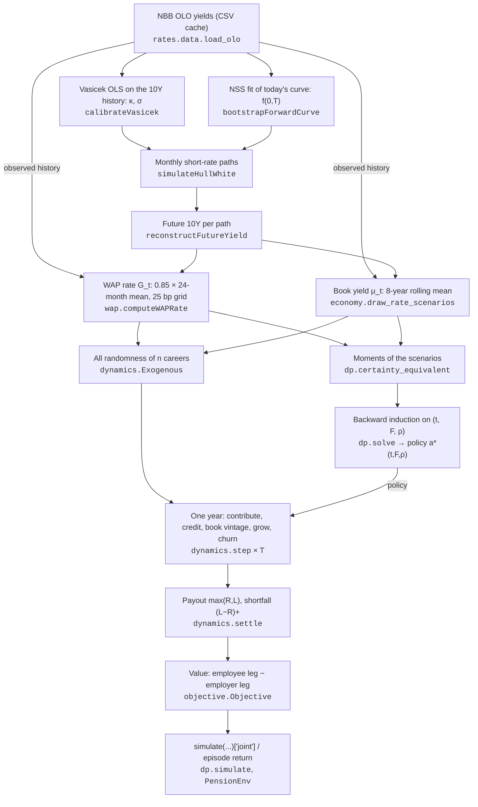

# Model walkthrough: from the OLO data to the objective, and one career by hand

This note follows the model in two ways:
- one interest-rate scenario, end to end, from the NBB data to the joint value $J$ that the DP oracle and the RL agent are scored on (Sections 1–2);
- one plan member, by hand, for three years under constant rates and under Hull-White rates (Section 3).

It then uses those numbers to show:
- why the reduced state $(t, F, \rho)$ is sufficient at constant rates (Section 4);
- why it stops being sufficient once the guarantee is booked horizontally at moving rates (Section 5).

The numbers come from the code. The blocks between `gen` markers are written by `python experiments/walkthrough.py --write`, and `--check` fails if any of them no longer matches the code.

---

## Notation

| Symbol | Meaning | Code |
|---|---|---|
| $R_t$, $L_t$, $S_t$ | Reserve, guaranteed (WAP) reserve, salary | `State.R`, `State.L`, `State.S` |
| $F = R/L$, $\rho = S/L$ | Funding ratio, salary-to-liability ratio | `State.F`, `State.rho` |
| $a_t \in [0,1]$ | Funding decision; contribution $c_t = a_t \Gamma S_t$ | `step(state, a, ...)` |
| $G_t$ | WAP guarantee rate fixed for year $t$ | `Exogenous.G` |
| $\mu_t$ | Credited return (constant $\mu$, or the book yield) | `Exogenous.mu` |
| $z_R, z_L$ | Asset and guarantee shocks, $N(0,1)$ | `Exogenous.zR`, `.zL` |
| $\delta_f$, $\delta_e$ | Employer and employee discount rates | `DISC_ER`, `DISC_EMP` |
| $\lambda$ | Employee weight; $(w_{emp}, w_{er}) = (\lambda, 1-\lambda)$ | `LAMBDA` |
| $\ddot a$ | Annuity factor | `ANNUITY` |

All parameters are in `pension/params.py` (`DEFAULT`). The trace uses `DEFAULT.replace(RATE_MODEL="hull_white")`.

---

## 1. The pipeline at a glance



There are two routes to a policy.
- **DP oracle.** It solves on the reduced state $(t, F, \rho)$ with rates summarised by their moments. See `certainty_equivalent` in Section 2.6.
- **RL agent.** It acts on the full path in `PensionEnv`.

Both are scored by the same `step()` and the same `Objective` (Section 2.8).

---

## 2. Data-flow trace of one scenario

### 2.1 Data
`load_olo()` reads the cached NBB series. The 10Y history drives the calibration, the WAP window and the book yield. The latest cross-section is the curve the model starts on.

<!-- gen:data -->
<!-- /gen -->

### 2.2 Vasicek: speed and volatility
OLS of $\Delta r = a + b\,r + \varepsilon$ on the monthly 10Y gives $\kappa = -b/\Delta t$, $\theta = -a/b$ and $\sigma = \mathrm{sd}(\varepsilon)/\sqrt{\Delta t}$. Hull-White keeps only $\kappa$ and $\sigma$.

<!-- gen:vasicek -->
<!-- /gen -->

The mean reversion is weak. $b$ is not significant at 10%, so $\kappa$ is imprecise, and it is estimated on the 10Y rather than on a short rate. These are known caveats of this step.

### 2.3 Nelson-Siegel-Svensson: today's curve
The NSS fit gives the forward curve $f(0,T)$ and its slope analytically. The Hull-White target that reprices today's curve is

$$
\theta(t) = f(0,t) + \frac{1}{\kappa}\frac{\partial f(0,t)}{\partial t} + \frac{\sigma^2}{2\kappa^2}\left(1-e^{-2\kappa t}\right).
$$

<!-- gen:nss -->
<!-- /gen -->

### 2.4 One rate path
`simulateHullWhite` steps $r = \alpha(t) + x(t)$ exactly, month by month, where
- $x$ is a zero-mean Ornstein-Uhlenbeck process;
- $\alpha(t) = f(0,t) + \frac{\sigma^2}{2\kappa^2}(1-e^{-\kappa t})^2$.

`reconstructFutureYield` then prices the 10-year bond at every month and path, $y_{10}(t) = -\ln P(t, t+10)/10$. Below is scenario 0 of a block of 200, drawn with `RATE_SEED`. It is the same draw `economy.draw_rate_scenarios` makes, rebuilt step by step and checked against it.

<!-- gen:paths -->
<!-- /gen -->

At month 0 the repriced 10Y is within a few basis points of the observed 4.12%. It is not exactly equal: the model reprices the NSS curve, and the NSS fit has a 1–3 bp error.

### 2.5 The contract rates: WAP fixings and book yield
The observed 10Y history is placed in front of the simulated months.

**WAP fixing.** Model year $k$ starts $12k$ months after the last observation. Its WAP rate averages the 24 months ending 8 months earlier (the 1 June → 1 January lag), times 0.85. The result is rounded to 25 bp and clipped to $[1.75\%, 3.75\%]$.

<!-- gen:wap -->
<!-- /gen -->

Year 0 uses observed data only, so $G_0 = 2.50\%$, which is the rate in force today.

**Book yield.** The credited return $\mu_k$ is the mean of the 10Y over the 8 years up to the start of year $k$. It reflects a Branch-21 portfolio that rolls over slowly.

<!-- gen:book -->
<!-- /gen -->

Both rates come from the same OLO path, which is what correlates the guarantee with the reserve.

### 2.6 The DP's view of the same scenarios
The DP cannot carry a rate path in its state. `certainty_equivalent` replaces the 5000 scenarios by constant moments. `solve` then optimises on $(t, F, \rho)$ with these moments:

<!-- gen:ce -->
<!-- /gen -->

### 2.7 All randomness of the careers, and one year by hand
`Exogenous.draw(p, n, seed, rates)` holds everything random about $n$ careers: the shocks, the churn uniforms, and the path's $G_t$, $\mu_t$. For career 0:

<!-- gen:exo -->
<!-- /gen -->

Year 0 of career 0 under the solved policy, each line one operation of `dynamics.step`:

<!-- gen:step -->
<!-- /gen -->

### 2.8 From careers to the objective
`settle` pays $\max(R_T, L_T)$, and the employer covers $(L_T - R_T)^+$. The `Objective` values the outcome per unit of final salary $S_T$:

$$
J = \lambda\, e^{-\delta_e T}\, \text{employee}(\text{RR}, \text{target}) \;-\; (1-\lambda)\Big[\sum_t e^{-\delta_f t}\,\frac{c_t}{S_T} + e^{-\delta_f T}\,\frac{(L_T - R_T)^+}{S_T}\Big].
$$

`PensionEnv` pays the first term at retirement, the contribution terms year by year, and the shortfall at retirement. So an episode's return is exactly one path's contribution to $J$, and the mean over the careers is `simulate(...)["joint"]`:

<!-- gen:joint -->
<!-- /gen -->

---

## 3. One career by hand: constant rates against Hull-White

**Setup.**
- Member: $R_0 = 1$, $L_0 = 1$, $S_0 = 20$ (so $F = 1$, $\rho = 20$).
- Action: $a = 0.5$ every year, i.e. a contribution of 7.5% of salary.
- Churn: none.
- Shocks: the same $z_R, z_L$ in both regimes. The Hull-White case uses the rates of scenario 0 from Section 2.

<!-- gen:shocks -->
<!-- /gen -->

**Constant rates.** $R$ is credited at $\mu = 3\%$ with noise $\sigma_R z_R$. $L$ is one pot growing at $G = 3\%$ with noise $\sigma_L z_L$.

<!-- gen:career_constant -->
<!-- /gen -->

**Hull-White.** $R$ is credited at the book yield $\mu_t$ (noise $\sigma_R z_R$). Each contribution is a separate vintage of the guarantee, locked at the $G_t$ of its year.

<!-- gen:career_hw -->
<!-- /gen -->

What the tables show:
- **Contributions and rewards are identical in the two regimes.** They depend only on $a$, $t$ and salary. The regimes differ only in how $R$ and $L$ grow.
- **The rates diverge from the constant case within three years.**
  - Credited return: the Hull-White book yield starts at 1.74%, below the constant 3%, so $R$ grows more slowly.
  - Guarantee: the first two vintages lock at 2.50%, the third at 3.00% and the fourth at 3.50%.
  - Net effect: early on, the lower guarantee outweighs the lower return, and $F$ ends above the constant-rate path.
- **In the constant case, $F$ and $\rho$ match the reduced form exactly.** The script recomputes them with `dp.F_next` / `dp.rho_next` from $(F, \rho, a, z)$ alone, and they equal the level computation (asserted to $10^{-12}$).

---

## 4. Why $(t, F, \rho)$ is a sufficient state at constant rates

One year in levels is

$$
R' = (R + c)\,e^{\mu + \sigma_R z_R},\qquad L' = (L + c)\,e^{G + \sigma_L z_L},\qquad S' = (1+W)\,S,\qquad c = a\Gamma S.
$$

Divide by $L$ and write $l = c/L = a\Gamma\rho$:

$$
F' = \frac{F + l}{1 + l}\, e^{(\mu - G) + \sigma_R z_R - \sigma_L z_L},
\qquad
\rho' = \frac{(1+W)\,\rho}{(1+l)\, e^{G + \sigma_L z_L}}.
$$

These are `dp.F_next` and `dp.rho_next`.
- **Transitions.** The next $(F, \rho)$ depends only on the current $(F, \rho)$, the action and the shocks. The level of $L$ (or $R$, $S$) does not enter.
- **Contribution cost.** It is $c_t / S_T = a\Gamma(1+W)^{-(T-t)}$, which depends only on $(a, t)$.
- **Terminal value.** It depends only on $F_T$ and $\rho_T$:
$$
\text{RR} = \text{RR}_{\text{legal}} + \frac{\max(F_T, 1)}{\ddot a\,\rho_T},
\qquad
\frac{(L_T - R_T)^+}{S_T} = \frac{\max(1 - F_T, 0)}{\rho_T}.
$$
- **Leavers.** After leaving, nothing random remains: $F$ grows at $\mu$ and $\rho$ at $1+W$. The leaver's value is a deterministic function of $(\tau, F, \rho)$, which is `paidup_service`.

So the model is homogeneous of degree zero in $(R, L, S)$, and $(t, F, \rho)$ is a Markov state for the whole objective. The scale-invariance check confirms it to $10^{-15}$ (`checks.scale_invariance`). The constant-rate table in Section 3 is one instance.

---

## 5. Where it stops being sufficient: horizontal vintages at moving rates

Under the horizontal method each contribution keeps the rate it was booked at:

$$
L' = \sum_{v} L_v\, e^{G_v} + c\, e^{G_t}
\quad\Longrightarrow\quad
\frac{L'}{L} = \sum_v w_v\, e^{G_v} + l\, e^{G_t},
\qquad w_v = \frac{L_v}{L}.
$$

The growth of $L$ now depends on the **composition** of the ledger, i.e. the weights $w_v$ and their locked rates. $F$ and $\rho$ cannot see this.

**A counterexample.** Two members have the same $R$, $L$ and $S$, hence the same $F$ and $\rho$, and take the same action at the same rates. They differ only in when their guarantee was booked.

<!-- gen:not_markov -->
<!-- /gen -->

Same $(F, \rho)$ today, different $F$ next year, and a liability at retirement that differs by about a third. So $(F, \rho)$ is not a Markov state here.

The rates themselves add more state.
- $G_{t+1}$ depends on the last 24 months of the 10Y, ending 8 months back.
- $\mu_{t+1}$ depends on the last 8 years of it.
- Under Hull-White the 10Y is a function of $(t, r_t)$, so a sufficient state is the short rate plus enough of its recent history to form those windows.

**What a minimal extended state looks like.**
- **Ledger.** $G$ only takes values on a 25 bp grid in $[1.75\%, 3.75\%]$, so the ledger compresses exactly into 9 buckets of "liability locked at rate $g$". Vintages with the same rate grow identically. `tests/test_dynamics.py` pins this compression against the full vintage ledger.
- **Rates.** $r_t$, plus the running sums behind the next WAP fixings and the book yield.

**Consequences.**
- **The DP uses the certainty-equivalent model (Section 2.6).** It keeps the tractable $(t, F, \rho)$ state and summarises the rate regime by moments. `simulate` then scores the resulting policy on the true path-wise rates. This is an approximation: the policy cannot react to the vintage mix or the rate history.
- **The RL observation is partially informative.** It is $(t/T, F, \log\rho, G_t, \mu_t)$: it carries today's rates but neither the bucket shares nor the rate history. The natural additions are
  - the 9 bucket shares $L_g/L$ (or their weighted mean rate),
  - the short rate $r_t$ or the running WAP average.

  This is also where an RL agent can in principle beat the certainty-equivalent DP.

---

## 6. Reproduce

```bash
python experiments/walkthrough.py            # print all blocks
python experiments/walkthrough.py --write    # refresh this document
python experiments/walkthrough.py --check    # fail if this document is out of date
```

The scenario, the career noise and the entry cohort are fixed by seeds (`RATE_SEED`, 7). The OLO data is the cached CSV, so the numbers change only when the code, the parameters or the data vintage change.
